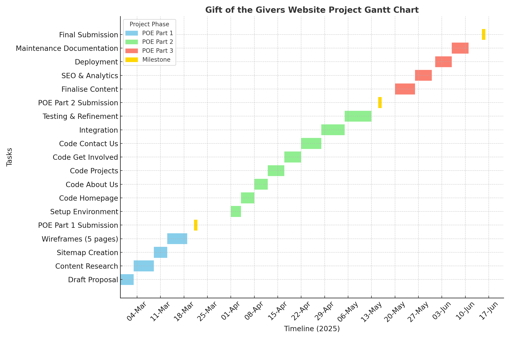
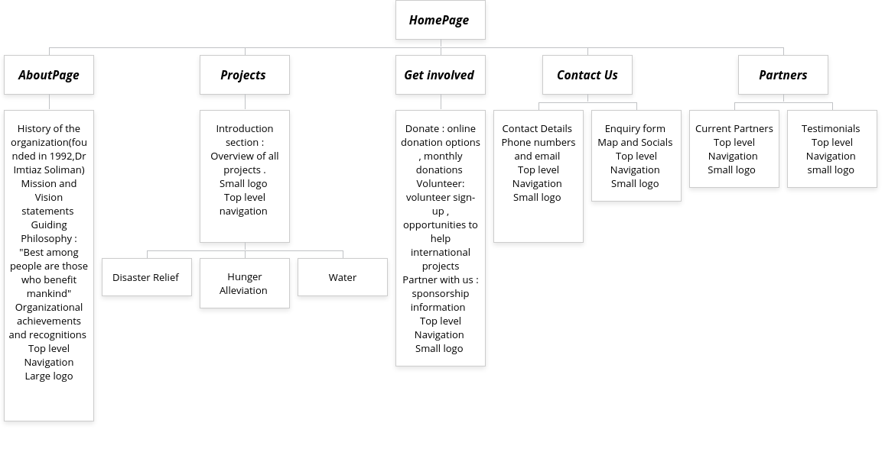

#1 Web Deveploment POE Assiginssment Part 1 
 Samkelisiwe Manyathi 
 ST10483489
 Group2 
 ## Project Overview

Project Title: Enhancing Digital Presence for Gift of the Givers Foundation

Project Purpose:
The purpose of this project is to design a user-friendly, engaging, and informative website for the Gift of the Givers Foundation, aimed at improving online visibility, increasing donor engagement, and efficiently showcasing the organization’s humanitarian efforts. This project also addresses accessibility, mobile responsiveness, and seamless user experience, ensuring that potential donors and volunteers can navigate the website intuitively.

Background:
Gift of the Givers Foundation is one of Africa’s largest independent disaster response NGOs, with a proven history of providing humanitarian aid across Africa and globally. Despite its strong impact, the organization’s digital presence requires enhancement to better communicate its work, attract donations, and mobilize volunteers. Research from nonprofit web design best practices highlights the importance of clear navigation, compelling visuals, mobile optimization, and impactful statistics (Trajectory Web Design, 2024; Double the Donation, n.d.; WildApricot, n.d.).
Project Objectives:

Redesign the website with modern UX/UI principles, focusing on accessibility, responsiveness, and user engagement.

Present clear, compelling information about the foundation’s initiatives, impact statistics, and donation channels.

Incorporate best practices from successful nonprofit and e-commerce platforms (Salesforce Commerce Cloud, Shopify, ASOS case studies).

Improve mobile accessibility and navigation to attract a wider audience.

Develop a scalable structure for future expansion of the website’s content. 

Project Scope:

Website Pages: Homepage, About Us, Initiatives/Programs, Impact, Donations, Contact, Volunteer.

Features: Interactive donation forms, statistics dashboard, mobile-friendly layout, search functionality, media galleries, social media integration.

Deliverables:

Wireframes for all key pages, illustrating layout and user flow.

Sitemap detailing page hierarchy and navigation structure.

Gantt chart outlining project timeline, milestones, and deadlines.

Software Used: Visual Studio Code for HTML development, Canva/other tools for wireframes, Microsoft Excel or project management software for the Gantt chart.

Methodology:
The project follows a phased approach:

Research & Analysis: Study the current website, competitor platforms, and nonprofit UX/UI best practices.

Design: Create wireframes and sitemap based on user-centered design principles.

Implementation: Build the website using HTML (and optional CSS for styling), ensuring responsiveness and accessibility.

Testing & Evaluation: Conduct usability testing to identify navigation or functionality issues.

Launch & Maintenance: Deploy the website and provide guidelines for updates and content management.

Expected Outcomes:

An intuitive and visually appealing website that clearly communicates the foundation’s mission.

Increased online donations and volunteer engagement.

Enhanced credibility and professional digital presence for the foundation.

Scalable and maintainable website structure to accommodate futture initiatives.
Project Timeline:
The project is planned to conclude by 17 September 2025, with tasks divided into research, design, development, testing, and final refinement stages, as illustrated in the Gantt chart.

## Website goals and objectives 
Increase Awareness: Clearly convey the NGO’s mission, history and impact to build credibility and trust. As one expert note that a non-profit website “must clearly state its mission, purpose, vision and values” and highlight why the work matters. 

Attract Donors: showcase impact and ensure easy giving. Potential donors want to know the organisation mission and the funds that will go towards the project. The site will provide donations options prominently  

Recruit Volunteers: Provide information on volunteer work and simple sign up. Feature stories of volunteer work to inspire engagement. 

Engage Community: offer channels of support to stay connected (website, newspapers and social media). Highlight successes stories and updates to encourage sharing.  

Fundraising Campaigns: Support current appeals (e.g. disaster relief) with dedicated pages and call –to-action. 

## Key Features and Functionality

Across All Pages (Global Features) 

Logo & Branding: Gift of the Givers logo appears consistently in the header. 

Top-Level Navigation: Menu with links to Home, About, Projects, Get Involved, Partners, Contact. 

Slogan: “Serving Humanity Since 1992” displayed under the logo. 

Search Bar: Allows users to quickly find information. 

Responsive Design: Optimised for desktop, tablet, and mobile viewing. 

Social Media Integration: Icons linking to Facebook, Twitter/X, Instagram, LinkedIn. 

Footer Section: Quick links, contact info, newsletter sign-up, and copyright notice. 

Homepage 

Hero Banner: High-resolution rotating images showing relief work. 

Mission Highlight: Short tagline about humanitarian work. 

Featured Projects Carousel: Quick previews with “Read More” buttons. 

Call-to-Action Buttons: Donate Now, Volunteer Today. 

Latest News Section: Updates from recent interventions. 

About Us 

Organisation History Timeline (1992 to present). 

Vision & Mission Section. 

Founder’s Story with portrait image. 

Team Profiles: Key leadership bios and photos. 

Recognition Section: Awards, achievements. 

Projects 

Project Categories Tabs: Disaster Relief, Water Provision, Hunger Alleviation, Healthcare, Education. 

Image Gallery: High-quality photos of interventions. 

Embedded YouTube Videos: Documentaries/project coverage. 

Success Stories: Short testimonials from beneficiaries. 

Downloadable Reports (PDFs for donors). 

Get Involved 

Donation Options: One-time, monthly, corporate sponsorship. 

Online Donation Form (secure form integrated with PayFast/PayPal). 

Volunteer Form: Online registration with availability options. 

Partnership Information: Downloadable sponsorship package. 

Impact Calculator: Shows what your contribution achieves (e.g., R100 = 10 meals). 

Contact Us 

Rich Contact Information: Address, phone numbers, emails for regional offices. 

Google Form: General enquiries form with auto-email notification. 

Google Map: Interactive map with pinned office locations. 

Quick Links: Partner enquiries, donation enquiries. 

Partners 

Display Grid of Partner Logos. 

Testimonials: Short quotes from current partners. 

Call-to-Action: “Become a Partner” button linking to enquiry form. 

 ## Timeline and Milestone 
 

 ## Site Map 
 

 ## References 

Canvas Business Model, 2025. ASOS Mission, Vision, and Values. [online] Available at: https://canvasbusinessmodel.com [Accessed 27 August 2025]. 

Double the Donation, n.d. 14 Essential Nonprofit Web Design Best Practices. [online] Available at: https://doublethedonation.com [Accessed 27 August 2025]. 

Gift of the Givers Foundation, n.d. About Us. [online] Available at: https://giftofthegivers.org [Accessed 27 August 2025]. 

Gift of the Givers Foundation, n.d. Homepage Impact Stats. [online] Available at: https://giftofthegivers.org [Accessed 27 August 2025]. 

Gift of the Givers, n.d. Wikipedia Entry. [online] Available at: https://en.wikipedia.org/wiki/Gift_of_the_Givers [Accessed 27 August 2025]. 

Hannan, A., n.d. ASOS – An E-Commerce UX/UI Case Study. Medium. [online] Available at: https://medium.com [Accessed 27 August 2025]. 

Salesforce Commerce Cloud, n.d. Ecommerce Checkout: 10 Best Practices. [online] Available at: https://salesforce.com [Accessed 27 August 2025]. 

Shopify, n.d. How to Increase Conversion Rate: 14 Tactics for 2025. [online] Available at: https://shopify.com [Accessed 27 August 2025]. 

Trajectory Web Design, 2024. 20 Must-Have Features Every Nonprofit Website Needs. [online] Available at: https://trajectorywebdesign.com [Accessed 27 August 2025]. 

WildApricot, n.d. What Potential Donors Want. [online] Available at: https://wildapricot.com [Accessed 27 August 2025]. 

Zalando, n.d. Engineering Principles (API-first, microservices). [online] Available at: https://github.com [Accessed 27 August 2025]. 

Sammy, 2025. Gift of the Givers Website Wireframes, Sitemap, and Gantt Chart. [o nine] Personal work. 

 

